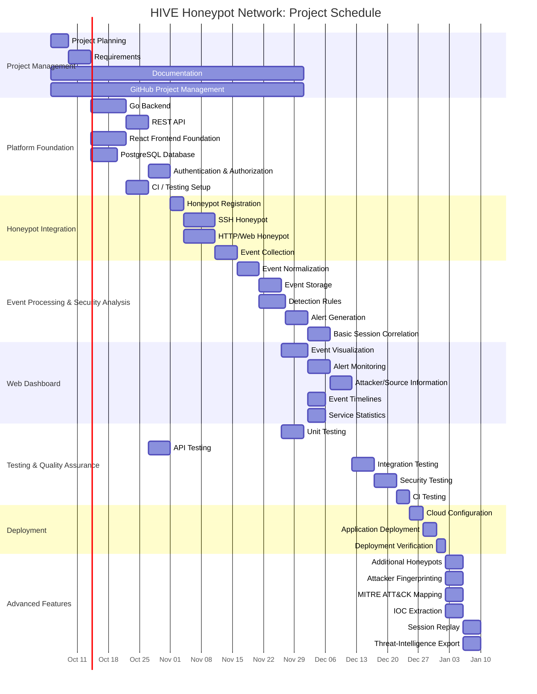

# HIVE Honeypot Network: Gantt Chart

The Gantt chart provides a high-level schedule for the development of the HIVE Honeypot Network. The planned project's anticipated completion deadline is **30 November 2026 at 23:59**.

## Final Deadline

**30 November 2026 at 23:59**

The schedule prioritizes the core HIVE functionality before the final phase. Advanced features are planned after the core platform, honeypot integration, event processing, dashboard, testing, and deployment work.

## Schedule Overview

| Phase | Planned Period |
|---|---|
| Project Management & Requirements | 5–13 October |
| Platform Foundation | 14–26 October |
| Honeypot Integration | 27 October–7 November |
| Event Processing & Security Analysis | 8–18 November |
| Web Dashboard | 13–22 November |
| Testing & Quality Assurance | 19–25 November |
| Deployment | 26–28 November |
| Advanced Features / Final Improvements | 27–30 November |
| **Final Deadline** | **30 November 2026, 23:59** |

