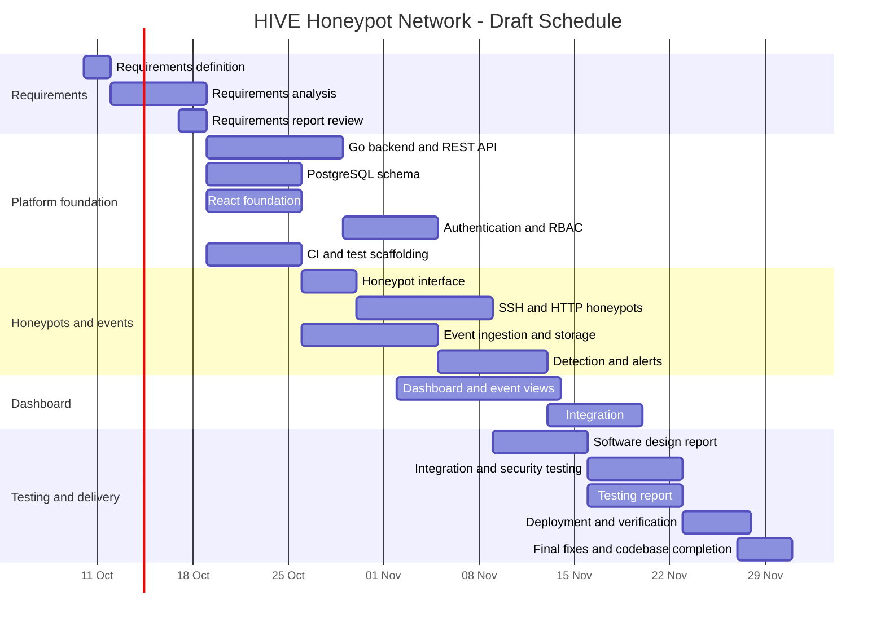

# HIVE Gantt Schedule (Draft)

> Dates are planning estimates aligned to the known course milestones. The codebase milestone is 30 November 2026.

```mermaid
gantt
    title HIVE Honeypot Network - Draft Schedule
    dateFormat YYYY-MM-DD
    axisFormat %d %b

    section Requirements
    Requirements definition :req, 2026-10-10, 2d
    Requirements analysis :analysis, after req, 7d
    Requirements report review :report, 2026-10-17, 2d

    section Platform foundation
    Go backend and REST API :backend, 2026-10-19, 10d
    PostgreSQL schema :db, 2026-10-19, 7d
    React foundation :frontend, 2026-10-19, 7d
    Authentication and RBAC :auth, after backend, 7d
    CI and test scaffolding :ci, 2026-10-19, 7d

    section Honeypots and events
    Honeypot interface :hp, 2026-10-26, 4d
    SSH and HTTP honeypots :honeypots, after hp, 10d
    Event ingestion and storage :events, after db, 10d
    Detection and alerts :detect, after events, 8d

    section Dashboard
    Dashboard and event views :dash, 2026-11-02, 12d
    Integration :integration, after detect, 7d

    section Testing and delivery
    Software design report :design, 2026-11-09, 7d
    Integration and security testing :testing, 2026-11-16, 7d
    Testing report :testreport, 2026-11-16, 7d
    Deployment and verification :deploy, 2026-11-23, 5d
    Final fixes and codebase completion :release, 2026-11-27, 4d
```
