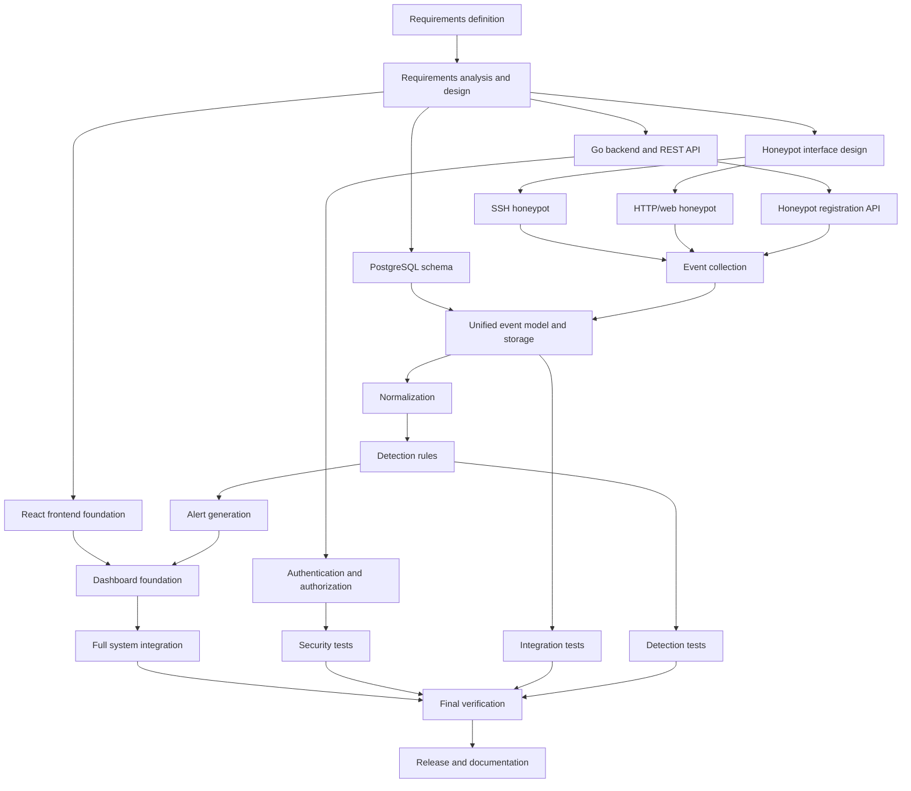

# HIVE Dependency Network (PERT-style)

This is a dependency network, not a calculated PERT duration analysis. Add optimistic, most-likely, and pessimistic estimates if your course requires numerical PERT calculations.

